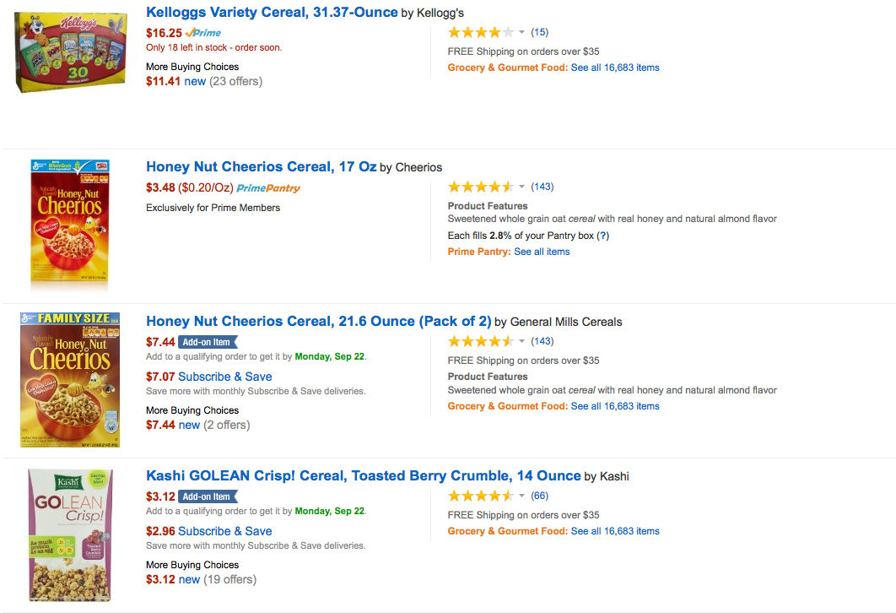
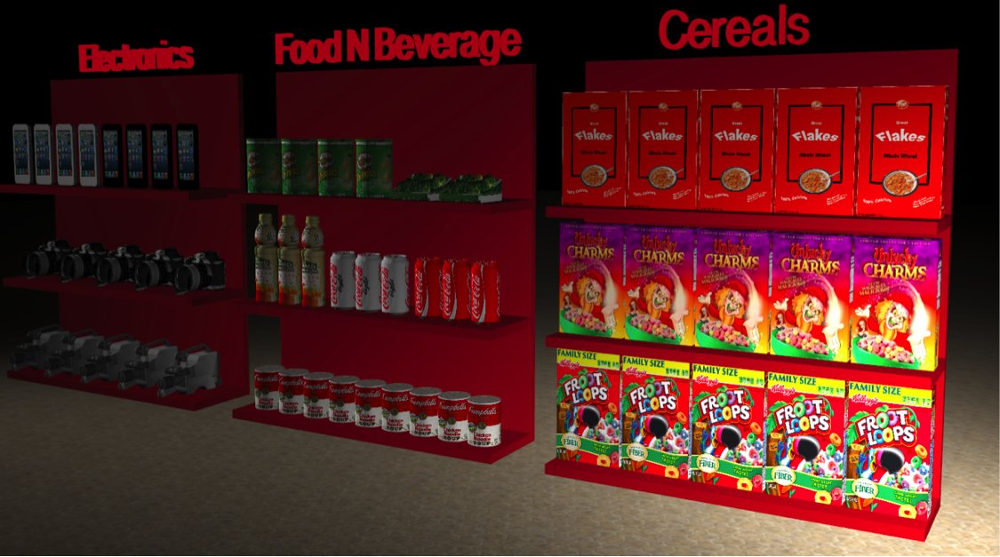

##[Demo](https://tenzin15.github.io/virtualstore)

# 3D Virtualstore
Build a 3D virtual store that can give more realistic shopping experience compared to traditional Amazon/Ebay static picture based shopping. 

### Technologies
  HTML5
  
  Javascript
  
  THREE.js (WebGL)

### Controls (how to move through the store, pick, rotate, products, etc.)
Pick a prouct: Double click on the product. 
Rotote the store: Hold left click and move the cursor.
Rotate a popped product: Use Left and Right Arrow. May hold ctrl.
Zoom in/out: Scroll the mouse up/down or swipe trackpad with two fingers.
Move through the shelves: User arrow keys or right click trackpad and swipe l/r/u/d. 

Traditional Online Shopping: Amazon Store

Our Online Shopping: 3D Virtualstore 

### Credits
[Tenzin Chhosphel](https://www.linkedin.com/in/tenzin15), Lukas Rascius, Parm Sahadeo, Ni Yao.

